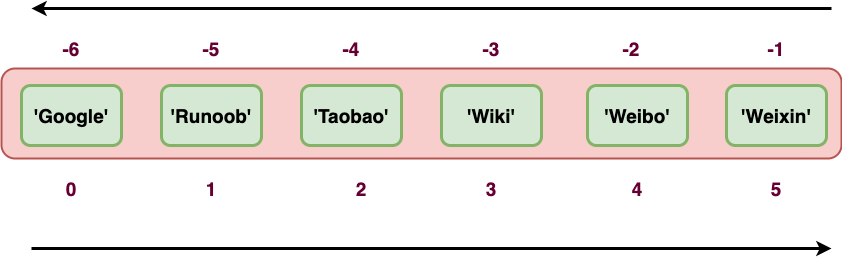
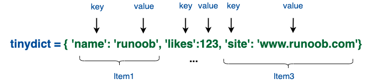

# Python-note
## 基础语法

### Python 保留字符

下面的列表显示了在Python中的保留字。这些保留字不能用作常数或变数，或任何其他标识符名称。

所有 Python 的关键字只包含小写字母。

| and      | exec    | not    |
| -------- | ------- | ------ |
| assert   | finally | or     |
| break    | for     | pass   |
| class    | from    | print  |
| continue | global  | raise  |
| def      | if      | return |
| del      | import  | try    |
| elif     | in      | while  |
| else     | is      | with   |
| except   | lambda  | yield  |

### print 输出

`print()` 若为数字则可直接输出，若为字符串（字母）则需加引号，双引号。亦可以输出运算符：如基本加减乘除，并会自动输出结果。

注意，用`print()`计算时，无需再跟引号。

**引号意义为输出即可**

print 默认输出是换行的，如果要实现不换行需要在变量末尾加上逗号 `,`。

```python
x="a"
y="b"
# 换行输出
print x
print y

print '---------'

# 不换行输出
print x,
print y,

# 不换行输出
print x,y
```

以上实例执行结果为：

```
a
b
---------
a b a b
```

#### 转义字符

- 对于转义字符，有反斜杠\起头，如 \n即为表示新的一行：newline
- \t表示启用新的一串字符表，通常四个字母为一个字符表.
- \r为退格覆盖，如print(‘hello\rworle’)则输出world
- \b即为退格，意指退掉前一位字母
- 使用 **r** 可以让反斜杠不发生转义，如 **r"this is a line with \n"** 则 **\n** 会显示，并不是换行。

同时，若print(‘’)的单引号内存在单引号，可使用\s使其存在

#### end 关键字

关键字end可以用于将结果输出到同一行，或者在输出的末尾添加不同的字符，实例如下：

```python
# Fibonacci series: 斐波纳契数列 
# 两个元素的总和确定了下一个数 
a, b = 0, 1 
while b < 1000:
	print(b, end=',')
	a, b = b, a+b
```

执行以上程序，输出结果为：

```python
1,1,2,3,5,8,13,21,34,55,89,144,233,377,610,987,
```

### 多行语句

Python语句中一般以新行作为语句的结束符。

但是我们可以使用斜杠（ \）将一行的语句分为多行显示，如下所示：

```python
total = item_one + \
        item_two + \
        item_three
```

语句中包含 [], {} 或 () 括号就不需要使用多行连接符。如下实例：

```python
days = ['Monday', 'Tuesday', 'Wednesday',
        'Thursday', 'Friday']
```

### 同一行使用多条语句

Python可以在同一行中使用多条语句，语句之间使用分号(;)分割，以下是一个简单的实例：

```python
import sys; x = 'runoob'; sys.stdout.write(x + '\n')
```


### Python 引号

Python 可以使用引号( **'** )、双引号( **"** )、三引号( **'''** 或 **"""** ) 来表示字符串，引号的开始与结束必须是相同类型的。

其中三引号可以由多行组成，编写多行文本的快捷语法，常用于文档字符串，在文件的特定地点，被当做注释。

```python
word = 'word'
sentence = "这是一个句子。"
paragraph = """这是一个段落。
包含了多个语句"""
```

### Python 注释

python中单行注释采用 **#** 开头。

```python
#第一个注释
print ("Hello, Python!")  # 第二个注释
```

注释可以在语句或表达式行末：

```python
name = "Runoob" # 这里的内容是一个注释
```

python 中多行注释使用三个单引号 **'''** 或三个双引号 **"""**。

```python
#!/usr/bin/python
# -*- coding: UTF-8 -*-
# 文件名：test.py


'''
这是多行注释，使用单引号。
这是多行注释，使用单引号。
这是多行注释，使用单引号。
'''

"""
这是多行注释，使用双引号。
这是多行注释，使用双引号。
这是多行注释，使用双引号。
"""
```

### import 与 from...import

在 python 用 **`import`** 或者 **`from...import`** 来导入相应的模块。

将整个模块(somemodule)导入，格式为： `import somemodule`

从某个模块中导入某个函数,格式为： **`from somemodule import somefunction`**

从某个模块中导入多个函数,格式为： **`from somemodule import firstfunc, secondfunc, thirdfunc`**

将某个模块中的全部函数导入，格式为： **`from somemodule import *`**

## 基本数据类型

Python 中的变量不需要声明。每个变量在使用前都必须赋值，变量赋值以后该变量才会被创建。

在 Python 中，变量就是变量，它没有类型，我们所说的"类型"是变量所指的内存中对象的类型。

等号（=）用来给变量赋值。

等号（=）运算符左边是一个变量名,等号（=）运算符右边是存储在变量中的值。例如：

```python
counter = 100          # 整型变量
miles   = 1000.0       # 浮点型变量
name    = "runoob"     # 字符串

print (counter)
print (miles)
print (name)
```

执行以上程序会输出如下结果：

```python
100
1000.0
runoob
```

### 多个变量赋值

Python允许你同时为多个变量赋值。例如：

```python
a = b = c = 1
```

以上实例，创建一个整型对象，值为 1，从后向前赋值，三个变量被赋予相同的数值。

您也可以为多个对象指定多个变量。例如：

```python
a, b, c = 1, 2, "runoob"
```

以上实例，两个整型对象 1 和 2 的分配给变量 a 和 b，字符串对象 "runoob" 分配给变量 c。

**若重复对某一变量赋值则会造成内存浪费。**

### 标准数据类型

Python3 中常见的数据类型有：

- Number（数字）
- String（字符串）
- bool（布尔类型）
- List（列表）
- Tuple（元组）
- Set（集合）
- Dictionary（字典）

Python3 的六个标准数据类型中：

- **不可变数据（3 个）：**Number（数字）、String（字符串）、Tuple（元组）；
- **可变数据（3 个）：**List（列表）、Dictionary（字典）、Set（集合）。

此外还有一些高级的数据类型，如: 字节数组类型(bytes)。

#### Number（数字）

python中数字有四种类型：整数、布尔型、浮点数和复数。

- **int** (整数), 如 1, 只有一种整数类型 int。
- **bool** (布尔), 如 True。
- **float** (浮点数), 如 1.23、3E-2
- **complex** (复数), 如 1 + 2j、 1.1 + 2.2j

数据类型是不允许改变的,这就意味着如果改变数字数据类型的值，将重新分配内存空间。

Python3 支持 **int、float、bool、complex（复数）**。

- **整型(int)** - 通常被称为是整型或整数，是正或负整数，不带小数点。Python3 整型是没有限制大小的，可以当作 Long 类型使用，所以 Python3 没有 Python2 的 Long 类型。布尔(bool)是整型的子类型，如1，2，3。
- **浮点型(float)** - 浮点型由整数部分与小数部分组成，浮点型也可以使用科学计数法表示（2.5e2 = 2.5 x 102 = 250），如1.1，3.1415。
- **复数( (complex))** - 复数由实数部分和虚数部分构成，可以用a + bj,或者complex(a,b)表示， 复数的实部a和虚部b都是浮点型。如3.14j，9.322e-36j。

我们可以使用十六进制和八进制来代表整数：

```python
number = 0xA0F # 十六进制
number
2575

number=0x37 # 八进制
number
31
```

像大多数语言一样，数值类型的赋值和计算都是很直观的。

内置的 type() 函数可以用来查询变量所指的对象类型。

```python
a, b, c, d = 20, 5.5, True, 4+3j

print(type(a), type(b), type(c), type(d))
```

以上实例输出：

```python
<class 'int'> <class 'float'> <class 'bool'> <class 'complex'>
```

此外还可以用 isinstance 来判断：

```python
a = 111

isinstance(a, int)
```

以上实例输出

```python
True
```

**isinstance 和 type 的区别在于：**

- type()不会认为子类是一种父类类型。
- isinstance()会认为子类是一种父类类型。

**注意：**Python3 中，bool 是 int 的子类，True 和 False 可以和数字相加，`True==1、False==0` 会返回 **True**，但可以通过 **is** 来判断类型。

**注意：**

- 1、Python可以同时为多个变量赋值，如a, b = 1, 2。
- 2、一个变量可以通过赋值指向不同类型的对象。
- 3、数值的除法包含两个运算符：**/** 返回一个浮点数，**//** 返回一个整数。
- 4、在混合计算时，Python会把整型转换成为浮点数。

##### Python 数字类型转换

有时候，我们需要对数据内置的类型进行转换，数据类型的转换，你只需要将数据类型作为函数名即可。

- **int(x)** 将x转换为一个整数。
- **float(x)** 将x转换到一个浮点数。
- **complex(x)** 将x转换到一个复数，实数部分为 x，虚数部分为 0。
- **complex(x, y)** 将 x 和 y 转换到一个复数，实数部分为 x，虚数部分为 y。x 和 y 是数字表达式。

以下实例将浮点数变量 a 转换为整数：

```python
>>> a = 1.0
>>> int(a)
1
```

##### Python 数字运算

Python 解释器可以作为一个简单的计算器，您可以在解释器里输入一个表达式，它将输出表达式的值。

表达式的语法很直白： **+**, **-**, ***** 和 **/**, 和其它语言（如Pascal或C）里一样。

**注意：**在不同的机器上浮点运算的结果可能会不一样。

在整数除法中，除法 **/** 总是返回一个浮点数，如果只想得到整数的结果，丢弃可能的分数部分，可以使用运算符 **//** :

```python
>>>17 / 3  # 整数除法返回浮点型
5.666666666666667
>>>17 // 3  # 整数除法返回向下取整后的结果
5
>>>17 % 3  # ％操作符返回除法的余数
2
>>>5 * 3 + 2 
17
```

**注意：`//` 得到的并不一定是整数类型的数，它与分母分子的数据类型有关系：若分子或分母中任意一个为浮点数，则输出结果为浮点数。

```python
>>>7//2
3
>>>7.0//2
3.0
>>>7//2.0
3.0
```

Python 可以使用 ***\*** 操作来进行幂运算：

```python
>>>5 ** 2  # 5 的平方
25
>>>2 ** 7  # 2的7次方
128
```

###### 数学函数

| 函数            | 返回值 ( 描述 )                                              |
| :-------------- | :----------------------------------------------------------- |
| abs(x)          | 返回数字的绝对值，如abs(-10) 返回 10                         |
| ceil(x)         | 返回数字的上入整数，如math.ceil(4.1) 返回 5                  |
| cmp(x, y)       | 如果 x < y 返回 -1, 如果 x == y 返回 0, 如果 x > y 返回 1。 **Python 3 已废弃，使用 (x>y)-(x<y) 替换**。 |
| exp(x)          | 返回e的x次幂(ex),如math.exp(1) 返回2.718281828459045         |
| fabs(x)         | 以浮点数形式返回数字的绝对值，如math.fabs(-10) 返回10.0      |
| floor(x)        | 返回数字的下舍整数，如math.floor(4.9)返回 4                  |
| log(x)          | 如math.log(math.e)返回1.0,math.log(100,10)返回2.0            |
| log10(x)        | 返回以10为基数的x的对数，如math.log10(100)返回 2.0           |
| max(x1, x2,...) | 返回给定参数的最大值，参数可以为序列。                       |
| min(x1, x2,...) | 返回给定参数的最小值，参数可以为序列。                       |
| modf(x)         | 返回x的整数部分与小数部分，两部分的数值符号与x相同，整数部分以浮点型表示。 |
| pow(x, y)       | x**y 运算后的值。                                            |
| round(x [,n\])  | 返回浮点数 x 的四舍五入值，如给出 n 值，则代表舍入到小数点后的位数。**其实准确的说是保留值将保留到离上一位更近的一端。** |
| sqrt(x)         | 返回数字x的平方根。                                          |

------

###### 随机数函数

随机数可以用于数学，游戏，安全等领域中，还经常被嵌入到算法中，用以提高算法效率，并提高程序的安全性。

Python包含以下常用随机数函数：

| 函数                        | 描述                                                         |
| :-------------------------- | :----------------------------------------------------------- |
| choice(seq)                 | 从序列的元素中随机挑选一个元素，比如random.choice(range(10))，从0到9中随机挑选一个整数。 |
| randrange (start,stop,step) | 从指定范围内，按指定基数递增的集合中获取一个随机数，基数默认值为 1 |
| random()]                   | 随机生成下一个实数，它在[0,1)范围内。                        |
| seed([x\])                  | 改变随机数生成器的种子seed。如果你不了解其原理，你不必特别去设定seed，Python会帮你选择seed。 |
| shuffle(lst)                | 将序列的所有元素随机排序                                     |
| uniform(x, y)               | 随机生成下一个实数，它在[x,y]范围内。                        |

------

###### 三角函数

Python包括以下三角函数：

| 函数        | 描述                                              |
| :---------- | :------------------------------------------------ |
| acos(x)     | 返回x的反余弦弧度值。                             |
| asin(x)     | 返回x的反正弦弧度值。                             |
| atan(x)     | 返回x的反正切弧度值。                             |
| atan2(y, x) | 返回给定的 X 及 Y 坐标值的反正切值。              |
| cos(x)      | 返回x的弧度的余弦值。                             |
| hypot(x, y) | 返回欧几里德范数 sqrt(x*x + y*y)。                |
| sin(x)      | 返回的x弧度的正弦值。                             |
| tan(x)      | 返回x弧度的正切值。                               |
| degrees(x)  | 将弧度转换为角度,如degrees(math.pi/2) ， 返回90.0 |
| radians(x)  | 将角度转换为弧度                                  |

------

###### 数学常量

| 常量 | 描述                                  |
| :--- | :------------------------------------ |
| pi   | 数学常量 pi（圆周率，一般以π来表示）  |
| e    | 数学常量 e，e即自然常数（自然常数）。 |

#### String（字符串）

- Python 中单引号 **`'`** 和双引号 `"` 使用完全相同。
- 使用三引号(**`'''`** 或 **`"""`**)可以指定一个多行字符串。
- 转义符  `\` 。
- 反斜杠可以用来转义，使用 **r** 可以让反斜杠不发生转义。 如 **r"this is a line with \n"** 则 **\n** 会显示，并不是换行。
- 按字面意义级联字符串，如 **"this " "is " "string"** 会被自动转换为 **this is string**。
- 字符串可以用 **+** 运算符连接在一起，用 ***** 运算符重复。
- Python 中的字符串有两种索引方式，从左往右以 `0` 开始，从右往左以 `-1` 开始。
- Python 中的字符串不能改变。
- Python 没有单独的字符类型，一个字符就是长度为 1 的字符串。
- 字符串的截取的语法格式如下：**变量[头下标:尾下标:步长]**

字符串是 Python 中最常用的数据类型。我们可以使用引号( **'** 或 **"** )来创建字符串。

创建字符串很简单，只要为变量分配一个值即可。例如：

```python
var1 = 'Hello World!'
var2 = "Runoob"
```


##### 访问字符串中的值

Python 不支持单字符类型，单字符在 Python 中也是作为一个字符串使用。

Python 访问子字符串，可以使用方括号 **[]** 来截取字符串，字符串的截取的语法格式如下：

```
变量[头下标:尾下标]
```

索引值以 0 为开始值，-1 为从末尾的开始位置。

**需要注意的是，在运用字符串的截取时，如`str[1:3]`，其表示`'str[1]'`+`'str[2]'`，而不会包含`str[3]`。**


如下实例：

```python
var1 = 'Hello World!'
var2 = "Runoob"

print ("var1[0]: ", var1[0])
print ("var2[1:5]: ", var2[1:5])
```

以上实例执行结果：

```python
var1[0]:  H
var2[1:5]:  unoo
```

加号 **+** 是字符串的连接符， 星号 ***** 表示复制当前字符串，与之结合的数字为复制的次数。实例如下：

```python
str = 'Runoob'

print (str)          # 输出字符串
print (str[0:-1])    # 输出第一个到倒数第二个的所有字符
print (str[0])       # 输出字符串第一个字符
print (str[2:5])     # 输出从第三个开始到第五个的字符，不包含str[5]
print (str[2:])      # 输出从第三个开始的后的所有字符
print (str * 2)      # 输出字符串两次，也可以写成 print (2 * str) 
print (str + "TEST") # 连接字符串
```

执行以上程序会输出如下结果：

```python
Runoob
Runoo
R
noo
noob
RunoobRunoob
RunoobTEST
```


##### 转义字符

在需要在字符中使用特殊字符时，python 用反斜杠 **\** 转义字符。如下表：

| 转义字符    | 描述                                                         | 实例                                                         |
| :---------- | :----------------------------------------------------------- | :----------------------------------------------------------- |
| \(在行尾时) | 续行符                                                       | `>>> print("line1 \ ... line2 \ ... line3") line1 line2 line3 >>> ` |
| \\          | 反斜杠符号                                                   | `>>> print("\\") \`                                          |
| \'          | 单引号                                                       | `>>> print('\'') '`                                          |
| \"          | 双引号                                                       | `>>> print("\"") "`                                          |
| \a          | 响铃                                                         | `>>> print("\a")`执行后电脑有响声。                          |
| \b          | 退格(Backspace)                                              | `>>> print("Hello \b World!") Hello World!`                  |
| \000        | 空                                                           | `>>> print("\000") >>> `                                     |
| \n          | 换行                                                         | `>>> print("\n")  >>>`                                       |
| \v          | 纵向制表符                                                   | `>>> print("Hello \v World!") Hello        World! >>>`       |
| \t          | 横向制表符                                                   | `>>> print("Hello \t World!") Hello    World! >>>`           |
| \r          | 回车，将 **\r** 后面的内容移到字符串开头，并逐一替换开头部分的字符，直至将 **\r** 后面的内容完全替换完成。 | `>>> print("Hello\rWorld!") World! >>> print('google runoob taobao\r123456') 123456 runoob taobao` |
| \f          | 换页                                                         | `>>> print("Hello \f World!") Hello        World! >>> `      |
| \yyy        | 八进制数，y 代表 0~7 的字符，例如：\012 代表换行。           | `>>> print("\110\145\154\154\157\40\127\157\162\154\144\41") Hello World!` |
| \xyy        | 十六进制数，以 \x 开头，y 代表的字符，例如：\x0a 代表换行    | `>>> print("\x48\x65\x6c\x6c\x6f\x20\x57\x6f\x72\x6c\x64\x21") Hello World!` |
| \other      | 其它的字符以普通格式输出                                     |                                                              |

以下实例，使用了不同的转义字符来演示单引号、换行符、制表符、退格符、换页符、ASCII、二进制、八进制数和十六进制数的效果：

```python
print('\'Hello, world!\'')  # 输出：'Hello, world!'

print("Hello, world!\nHow are you?")  # 输出：Hello, world!
                                        #       How are you?

print("Hello, world!\tHow are you?")  # 输出：Hello, world!    How are you?

print("Hello,\b world!")  # 输出：Hello world!

print("Hello,\f world!")  # 输出：
                           # Hello,
                           #  world!

print("A 对应的 ASCII 值为：", ord('A'))  # 输出：A 对应的 ASCII 值为： 65

print("\x41 为 A 的 ASCII 代码")  # 输出：A 为 A 的 ASCII 代码

decimal_number = 42
binary_number = bin(decimal_number)  # 十进制转换为二进制
print('转换为二进制:', binary_number)  # 转换为二进制: 0b101010

octal_number = oct(decimal_number)  # 十进制转换为八进制
print('转换为八进制:', octal_number)  # 转换为八进制: 0o52

hexadecimal_number = hex(decimal_number)  # 十进制转换为十六进制
print('转换为十六进制:', hexadecimal_number) # 转换为十六进制: 0x2a
```


##### 字符串运算符

下表实例变量 a 值为字符串 "Hello"，b 变量值为 "Python"：

| 操作符 | 描述                                                         | 实例                            |
| :----- | :----------------------------------------------------------- | :------------------------------ |
| +      | 字符串连接                                                   | a + b 输出结果： HelloPython    |
| *      | 重复输出字符串                                               | a*2 输出结果：HelloHello        |
| []     | 通过索引获取字符串中字符                                     | a[1] 输出结果 **e**             |
| [ : ]  | 截取字符串中的一部分，遵循**左闭右开**原则，str[0:2] 是不包含第 3 个字符的。 | a[1:4] 输出结果 **ell**         |
| in     | 成员运算符 - 如果字符串中包含给定的字符返回 True             | **'H' in a** 输出结果 True      |
| not in | 成员运算符 - 如果字符串中不包含给定的字符返回 True           | **'M' not in a** 输出结果 True  |
| r/R    | 原始字符串 - 原始字符串：所有的字符串都是直接按照字面的意思来使用，没有转义特殊或不能打印的字符。 原始字符串除在字符串的第一个引号前加上字母 **r**（可以大小写）以外，与普通字符串有着几乎完全相同的语法。 | `print( r'\n' ) print( R'\n' )` |


##### 字符串格式化

Python 支持格式化字符串的输出 。

有如下三种方法：

- 占位符
- f-string
- str.format()方法


**占位符**

使用%s，%d，%f，%lf作为占位符

```python
name = "张三"
age = "18"
score = "98.5"
print('姓名:%s,年龄:%d,成绩:%f' % (name,age,score))
```


**f-string**

转义字符f处理字符串

```python
print(f'姓名:{name},年龄:{age},成绩:{score}')
```

**str.format()方法**

```python
print('姓名:{0},年龄:{1},成绩:{2}'.format(name,age,score))
```


##### format的详细格式控制

| :        | 引导符号                                   |
| -------- | ------------------------------------------ |
| 填充     | 填充                                       |
| 对齐方式 | < 左对齐    >右对齐    ^居中对齐           |
| 宽度     | 字符串的输出宽度                           |
| ,        | 数字的千位分隔符                           |
| .精度    | 浮点数小数部分的精度或字符串的最大输出长度 |
| 类型     | 整数类型:b\d\o\x\X    浮点数类型:e\E\f\%   |

用例

```python
s = 'helloworld'
print('{0:*<20}'.format(s))		#0代表第一个参数，即s；字符串的显示宽度为20，左对齐，空白部分使用*填充
print('{0:*>20}'.format(s))
print('{0:*^20}'.format(s))
#千分位分隔符
print('{0:,}'.format(987654321))
print('{0:,}'.format(987654321.9876))

#浮点数小数部分的精度
print('{0:.2f}'.format(3.1415926))
#字符串类型 .表示是最大的显示长度
print('{0:.5}'.format('helloworld'))

#整数类型
print('二进制:{0:b},八进制:{0:o},十进制:{0:d},十六进制:{0:x},十六进制:{0:X}'.format(425))

#浮点数类型
print('{0:.2f},{0:.2E},{0:.2e},{0:.2%}'.format(3.1415926))
```

输出结果：

```
helloworld**********
**********helloworld
*****helloworld*****
987,654,321
987,654,321.9876
3.14
hello
二进制:110101001,八进制:651,十进制:425,十六进制:1a9,十六进制:1A9
3.14,3.14E+00,3.14e+00,314.16%
```


##### 字符串的编码和解码

**编码**

将str类型转换为bytes类型，需要使用到字符串的encode()方法；语法格式为：

```python
str.encode(encoding = 'utf-8' , errors = 'strict/ignore/replace')
```

**解码**

将bytes类型转换为str类型，需要使用的bytes类型的decode()方法；语法格式为：

```python
bytes.decode(encoding = 'utf-8' , errors = 'strict/ignore/replace')
```


errors需要从三个属性中选择一个

- strict：终端报错，编码错误
- ignore：忽略
- replace：替换为"?"

##### 数据的验证

| 方法名          | 描述说明                                                   |
| --------------- | ---------------------------------------------------------- |
| str.isdigit()   | 所有字符都是数字(阿拉伯数字)                               |
| str.isnumeric() | 所有的字符都是数字(阿拉伯数字，罗马数字，中文数字(一、壹)) |
| str.isalpha()   | 所有的字符都是字母(包含中文字符)                           |
| str.isalnum()   | 所有字符都是数字或字母(包含中文字符)                       |
| str.islower()   | 所有字符都是小写(中文既是大写又是小写)                     |
| str.isupper()   | 所有字符都是大写(中文既是大写又是小写)                     |
| str.istitle()   | 所有字符都是首字母大写(以空格区分单词)                     |
| str.isspace()   | 所有字符都是空白字符(\n、\t等)                             |


##### 字符串的拼接

1. 使用 '+' 进行拼接

2. 使用字符串的join()方法 

   ```python
   print(''.join([s1,s2])) 	#使用空字符串进行拼接
   print('*'.join(['hello','world','python','java''rust]))
   print('你好'.join(['hello','world','python','java','rust']))
   ```

   输出结果为：

   ```python
   htlloworld
   hello*world*python*javarust
   hello你好world你好python你好java你好rust
   ```

3. 直接拼接

   ```python
   print('hello''world')
   ```

4. 使用格式化字符串进行拼接


##### 字符串的去重

1. 字符串拼接及not in

   ```python
   s = 'helloworldhelloworldhelloworldfjoaisjd'
   new_s = ''
   for item in s:
       if item not in new_s:
           new_s += item
   print(new_s)
   ```

   输出结果

   ```python
   helowrdfjais
   ```

2. 使用索引+not in

   ```python
   new_s2 = ''
   for i i range(len(s)):
       if s[i] not in new_s2:
           new_s2 += s[i]
   print(new_s2)
   ```

3. 通过集合去重+列表排序

   ```python
   new_s3 = set(s)
   lst = list(new_s3)
   lst.sort(key = s.index)
   print(''.join(lst))
   ```

   

##### Python三引号

python三引号允许一个字符串跨多行，字符串中可以包含换行符、制表符以及其他特殊字符。

**注意：**

- 1、反斜杠可以用来转义，使用r可以让反斜杠不发生转义。
- 2、字符串可以用+运算符连接在一起，用*运算符重复。
- 3、Python中的字符串有两种索引方式，从左往右以0开始，从右往左以-1开始。
- 4、Python中的字符串不能改变。

#### bool（布尔类型）

布尔类型即 True 或 False。

在 Python 中，True 和 False 都是关键字，表示布尔值。

布尔类型可以用来控制程序的流程，比如判断某个条件是否成立，或者在某个条件满足时执行某段代码。

布尔类型特点：

- 布尔类型只有两个值：True 和 False。
- 布尔类型可以和其他数据类型进行比较，比如数字、字符串等。在比较时，Python 会将 True 视为 1，False 视为 0。
- 布尔类型可以和逻辑运算符一起使用，包括 and、or 和 not。这些运算符可以用来组合多个布尔表达式，生成一个新的布尔值。
- 布尔类型也可以被转换成其他数据类型，比如整数、浮点数和字符串。在转换时，True 会被转换成 1，False 会被转换成 0。

**注意:** 在 Python 中，所有非零的数字和非空的字符串、列表、元组等数据类型都被视为 True，只有 **0、空字符串、空列表、空元组**等被视为 False。因此，在进行布尔类型转换时，需要注意数据类型的真假性。

#### List（列表）

List（列表） 是 Python 中使用最频繁的数据类型。

**List内部元素是允许重复的！**

列表可以完成大多数集合类的数据结构实现。列表中元素的类型可以不相同，它支持数字，字符串甚至可以包含列表（所谓嵌套）。

列表是写在方括号 **[]** 之间、用逗号分隔开的元素列表。

和字符串一样，列表同样可以被索引和截取，列表被截取后返回一个包含所需元素的新列表。

创建列表有两种方式，一为：

```python
A = [‘hello’,’world’,98]
```

二为：

```python
B = list([‘hello’,’world’,98])
```

列表截取的语法格式如下：

```
变量[头下标:尾下标]
```

##### 访问列表中的值

使用下标索引来访问列表中的值，同样你也可以使用方括号的形式截取字符，如下所示：

```python
list1 = ['physics', 'chemistry', 1997, 2000]
list2 = [1, 2, 3, 4, 5, 6, 7 ]

print "list1[0]: ", list1[0]
print "list2[1:5]: ", list2[1:5]
```

以上实例输出结果：

```python
list1[0]:  physics
list2[1:5]:  [2, 3, 4, 5]
```

索引值以 **0** 为开始值，**-1** 为从末尾的开始位置。

**需要注意的是，在运用列表的截取时，如`list[1:3]`，其包含`list[1]`，`list[2]`，而不会包含`list[3]`。**


加号 **+** 是列表连接运算符，星号 ***** 是重复操作。如下实例：

```python
list = [ 'abcd', 786 , 2.23, 'runoob', 70.2 ]
tinylist = [123, 'runoob']

print (list)            # 输出完整列表
print (list[0])         # 输出列表第一个元素
print (list[1:3])       # 从第二个开始输出到第三个元素，并不会输出list[3]
print (list[2:])        # 输出从第三个元素开始的所有元素
print (tinylist * 2)    # 输出两次列表
print (list + tinylist) # 连接列表
```

以上实例输出结果：

```python
['abcd', 786, 2.23, 'runoob', 70.2]
abcd
[786, 2.23]
[2.23, 'runoob', 70.2]
[123, 'runoob', 123, 'runoob']
['abcd', 786, 2.23, 'runoob', 70.2, 123, 'runoob']
```

与Python字符串不一样的是，列表中的元素是可以改变的：

```python
a = [1, 2, 3, 4, 5, 6]
a[0] = 9
a[2:5] = [13, 14, 15]
a
[9, 2, 13, 14, 15, 6]
a[2:5] = []   # 将对应的元素值设置为 [] 
a
[9, 2, 6]
```

##### 更新列表

可以对列表的数据项进行修改或更新，使用append()方法来添加列表项，如下所示：

```python
list = []          ## 空列表

list.append('Google')   ## 使用 append() 添加元素
list.append('Runoob')
print list
```

以上实例输出结果：

```python
['Google', 'Runoob']
```

##### 删除列表元素

可以使用 del 语句来删除列表的元素，如下实例：

```python
list1 = ['physics', 'chemistry', 1997, 2000]

print list1
del list1[2]
print "After deleting value at index 2 : "
print list1
```

以上实例输出结果：

```python
['physics', 'chemistry', 1997, 2000]
After deleting value at index 2 :
['physics', 'chemistry', 2000]
```

##### Python列表脚本操作符

列表对 + 和 * 的操作符与字符串相似。+ 号用于组合列表，* 号用于重复列表。

如下所示：

| Python 表达式                | 结果                         | 描述                 |
| :--------------------------- | :--------------------------- | :------------------- |
| len([1, 2, 3])               | 3                            | 长度                 |
| [1, 2, 3] + [4, 5, 6]        | [1, 2, 3, 4, 5, 6]           | 组合                 |
| ['Hi!'] * 4                  | ['Hi!', 'Hi!', 'Hi!', 'Hi!'] | 重复                 |
| 3 in [1, 2, 3]               | True                         | 元素是否存在于列表中 |
| for x in [1, 2, 3]: print x, | 1 2 3                        | 迭代                 |

##### Python列表函数&方法

Python包含以下函数:

| 序号 | 函数                                           |
| :--- | :--------------------------------------------- |
| 1    | [cmp(list1, list2)]         比较两个列表的元素 |
| 2    | [len(list)]         列表元素个数               |
| 3    | [max(list)]       返回列表元素最大值           |
| 4    | [min(list)]         返回列表元素最小值         |
| 5    | [list(seq)]         将元组转换为列表           |

Python包含以下方法:

| 序号 | 方法                                                         |
| :--- | :----------------------------------------------------------- |
| 1    | list.append(obj)               在列表末尾添加新的对象        |
| 2    | list.count(obj)            统计某个元素在列表中出现的次数    |
| 3    | list.extend(seq)          在列表末尾一次性追加另一个序列中的多个值（用新列表扩展原来的列表） |
| 4    | list.index(obj)          从列表中找出某个值第一个匹配项的索引位置 |
| 5    | list.insert(index, obj)      将对象插入列表                  |
| 6    | list.pop(index=-1)       移除列表中的一个元素（默认最后一个元素），并且返回该元素的值 |
| 7    | list.remove(obj)         移除列表中某个值的第一个匹配项      |
| 8    | list.reverse()            反向列表中元素                     |
| 9    | list.sort(cmp=None, key=None, reverse=False)        对原列表进行排序 |

**注意：**

- 1、List写在方括号之间，元素用逗号隔开。
- 2、和字符串一样，list可以被索引和切片。
- 3、List可以使用+操作符进行拼接。
- 4、List中的元素是可以改变的。

#### Tuple（元组）

Python 的元组与列表类似，不同之处在于元组的元素不能修改。

元组使用小括号 **( )**，列表使用方括号 **[ ]**。

元组创建很简单，只需要在括号中添加元素，并使用逗号隔开即可。

如下实例：

```python
tup1 = ('Google', 'Runoob', 1997, 2000)
tup2 = (1, 2, 3, 4, 5 )
tup3 = "a", "b", "c", "d"   #  不需要括号也可以
```

创建空元组

```python
tup1 = ()
```

元组中只包含一个元素时，需要在元素后面添加逗号 **,** 否则括号会被当作运算符使用：

```python
tup1 = (50,)
```

```python
>>>tup1 = (50)
>>>type(tup1)     # 不加逗号，类型为整型
<class 'int'>

>>>tup1 = (50,)
>>>type(tup1)     # 加上逗号，类型为元组
<class 'tuple'>
```

元组与字符串类似，下标索引从0开始，可以进行截取，组合等。


##### 访问元组

元组可以使用下标索引来访问元组中的值，如下实例:

```python
tup1 = ('physics', 'chemistry', 1997, 2000)
tup2 = (1, 2, 3, 4, 5, 6, 7 )

print ("tup1[0]: ", tup1[0])
print ("tup2[1:5]: ", tup2[1:5])
```

以上实例输出结果：

```
tup1[0]:  physics
tup2[1:5]:  (2, 3, 4, 5)
```

##### 修改元组

元组中的元素值是不允许修改的，但我们可以对元组进行连接组合，如下实例:

```python
tup1 = (12, 34.56)
tup2 = ('abc', 'xyz')

# 以下修改元组元素操作是非法的。

# tup1[0] = 100

# 创建一个新的元组

tup3 = tup1 + tup2
print (tup3)
```

以上实例输出结果：

```python
(12, 34.56, 'abc', 'xyz')
```

##### 删除元组

元组中的元素值是不允许删除的，但我们可以使用del语句来删除整个元组，如下实例:

```python
tup = ('Google', 'Runoob', 1997, 2000)

print (tup)
del tup
print ("删除后的元组 tup : ")
print (tup)
```

以上实例元组被删除后，输出变量会有异常信息，输出如下所示：

```
删除后的元组 tup : 
Traceback (most recent call last):
  File "test.py", line 8, in <module>
    print (tup)
NameError: name 'tup' is not defined
```

##### 元组运算符

与字符串一样，元组之间可以使用 **+**、**+=**和 ***** 号进行运算。这就意味着他们可以组合和复制，运算后会生成一个新的元组。

| Python 表达式                                                | 结果                         | 描述                                                         |
| :----------------------------------------------------------- | :--------------------------- | :----------------------------------------------------------- |
| `len((1, 2, 3))`                                             | 3                            | 计算元素个数                                                 |
| >>> a = (1, 2, 3)<br />>>> b = (4, 5, 6)<br />>>> c = a+b <br />>>> c <br />(1, 2, 3, 4, 5, 6) | (1, 2, 3, 4, 5, 6)           | 连接，c 就是一个新的元组，它包含了 a 和 b 中的所有元素。     |
| >>> a = (1, 2, 3) <br />>>> b = (4, 5, 6) <br />>>> a += b <br />>>> a <br />(1, 2, 3, 4, 5, 6) | (1, 2, 3, 4, 5, 6)           | 连接，a 就变成了一个新的元组，它包含了 a 和 b 中的所有元素。 |
| `('Hi!',) * 4`                                               | ('Hi!', 'Hi!', 'Hi!', 'Hi!') | 复制                                                         |
| `3 in (1, 2, 3)`                                             | True                         | 元素是否存在                                                 |
| for x in (1, 2, 3):     <br />      print (x, end=" ")       | 1 2 3                        | 迭代                                                         |

##### 元组索引，截取

因为元组也是一个序列，所以我们可以访问元组中的指定位置的元素，也可以截取索引中的一段元素，如下所示：

元组：

```python
tup = ('Google', 'Runoob', 'Taobao', 'Wiki', 'Weibo','Weixin')
```



```python
>>>tup = ('Google', 'Runoob', 'Taobao', 'Wiki', 'Weibo','Weixin')
>>>tup[1]
'Runoob'
>>>tup[-2]
'Weibo'
>>>tup[1:]
('Runoob', 'Taobao', 'Wiki', 'Weibo', 'Weixin')
>>>tup[1:4]
('Runoob', 'Taobao', 'Wiki')
```

##### 元组内置函数

Python元组包含了以下内置函数

| 序号 | 方法及描述                               | 实例                                                         |
| :--- | :--------------------------------------- | :----------------------------------------------------------- |
| 1    | len(tuple) 计算元组元素个数。            | >>> tuple1 = ('Google', 'Runoob', 'Taobao') <br />>>> len(tuple1) <br />3 |
| 2    | max(tuple) 返回元组中元素最大值。        | >>> tuple2 = ('5', '4', '8') <br />>>> max(tuple2)<br />'8'  |
| 3    | min(tuple) 返回元组中元素最小值。        | >>> tuple2 = ('5', '4', '8') <br />>>> min(tuple2) <br />'4' |
| 4    | tuple(iterable) 将可迭代系列转换为元组。 | >>> list1= ['Google', 'Taobao', 'Runoob', 'Baidu'] <br />>>> tuple1=tuple(list1) <br />>>> tuple1<br /> ('Google', 'Taobao', 'Runoob', 'Baidu') |

##### 关于元组是不可变的

所谓元组的不可变指的是元组所指向的内存中的内容不可变。

```python
>>> tup = ('r', 'u', 'n', 'o', 'o', 'b')
>>> tup[0] = 'g'   # 不支持修改元素
Traceback (most recent call last):
 File "<stdin>", line 1, **in** <module>
TypeError: 'tuple' object does **not** support item assignment
>>> id(tup)   # 查看内存地址
4440687904
>>> tup = (1,2,3)
>>> id(tup)
4441088800   # 内存地址不一样了
```

从以上实例可以看出，重新赋值的元组 tup，绑定到新的对象了，不是修改了原来的对象。

#### Set（集合）

集合（set）是一个无序的不重复元素序列。

集合中的元素不会重复，并且可以进行交集、并集、差集等常见的集合操作。

可以使用大括号 **{ }** 创建集合，元素之间用逗号 **,** 分隔， 或者也可以使用 **set()** 函数创建集合。

**创建格式：**

```
parame = {value01,value02,...}
或者
set(value)
```

以下是一个简单实例：

```
set1 = {1, 2, 3, 4}            # 直接使用大括号创建集合
set2 = set([4, 5, 6, 7])      # 使用 set() 函数从列表创建集合
```

**注意：**创建一个空集合必须用 **set()** 而不是 **{ }**，因为 **{ }** 是用来创建一个空字典。

```python
>>>basket = {'apple', 'orange', 'apple', 'pear', 'orange', 'banana'}
>>>print(basket)                      # 这里演示的是去重功能
{'orange', 'banana', 'pear', 'apple'}
>>>'orange' in basket                 # 快速判断元素是否在集合内
True
>>>'crabgrass' in basket
False

# 下面展示两个集合间的运算.
...
>>>a = set('abracadabra')
>>>b = set('alacazam')
>>>a                                  
{'a', 'r', 'b', 'c', 'd'}
>>>a - b                              # 集合a中包含而集合b中不包含的元素
{'r', 'd', 'b'}
>>>a | b                              # 集合a或b中包含的所有元素
{'a', 'c', 'r', 'd', 'b', 'm', 'z', 'l'}
>>>a & b                              # 集合a和b中都包含了的元素
{'a', 'c'}
>>>a ^ b                              # 不同时包含于a和b的元素
{'r', 'd', 'b', 'm', 'z', 'l'}
```

##### 集合的基本操作

###### 1、添加元素

**语法格式如下：**

```
s.add( x )
```

将元素 x 添加到集合 s 中，如果元素已存在，则不进行任何操作。

```python
>>>thisset = set(("Google", "Runoob", "Taobao"))
>>>thisset.add("Facebook")
>>>print(thisset)
{'Taobao', 'Facebook', 'Google', 'Runoob'}
```

还有一个方法，也可以添加元素，且参数可以是列表，元组，字典等，语法格式如下：

```python
s.update( x )
```

x 可以有多个，用逗号分开。

```python
>>>thisset = set(("Google", "Runoob", "Taobao"))
>>>thisset.update({1,3})
>>>print(thisset)
{1, 3, 'Google', 'Taobao', 'Runoob'}
>>>thisset.update([1,4],[5,6])  
>>>print(thisset)
{1, 3, 4, 5, 6, 'Google', 'Taobao', 'Runoob'}
```

###### 2、移除元素

**语法格式如下：**

```
s.remove( x )
```

将元素 x 从集合 s 中移除，如果元素不存在，则会发生错误。

```python
>>>thisset = set(("Google", "Runoob", "Taobao"))
>>>thisset.remove("Taobao")
>>>print(thisset)
{'Google', 'Runoob'}
>>>thisset.remove("Facebook")   # 不存在会发生错误
Traceback (most recent call last):
	File "<stdin>", line 1, in <module>
KeyError: 'Facebook'
```

此外还有一个方法也是移除集合中的元素，且如果元素不存在，不会发生错误。格式如下所示：

```python
s.discard( x )
```

```python
>>>thisset = set(("Google", "Runoob", "Taobao"))
>>>thisset.discard("Facebook")  # 不存在不会发生错误
>>>print(thisset)
{'Taobao', 'Google', 'Runoob'}
```

我们也可以设置随机删除集合中的一个元素，语法格式如下：

```python
s.pop() 
```

```python
thisset = set(("Google", "Runoob", "Taobao", "Facebook"))
x = thisset.pop()

print(x)
```

输出结果：

```python
Runoob
```

多次执行测试结果都不一样。

set 集合的 pop 方法会对集合进行无序的排列，然后将这个无序排列集合的左面第一个元素进行删除。

###### 3、计算集合元素个数

**语法格式如下：**

```
len(s)
```

计算集合 s 元素个数。

```python
>>> thisset = set(("Google", "Runoob", "Taobao"))
>>> len(thisset)
3
```

###### 4、清空集合

**语法格式如下：**

```
s.clear()
```

清空集合 s。

```python
>>> thisset = set(("Google", "Runoob", "Taobao"))
>>> thisset.clear()
>>> **print**(thisset)
set()
```

###### 5、判断元素是否在集合中存在

**语法格式如下：**

```
x in s
```

判断元素 x 是否在集合 s 中，存在返回 True，不存在返回 False。

```python
>>> thisset = set(("Google", "Runoob", "Taobao"))
>>> "Runoob" in thisset
True
>>> "Facebook" in thisset
False
```

##### 集合内置方法完整列表

| 方法                          | 描述                                                         |
| :---------------------------- | :----------------------------------------------------------- |
| add()                         | 为集合添加元素                                               |
| clear()                       | 移除集合中的所有元素                                         |
| copy()                        | 拷贝一个集合                                                 |
| difference()                  | 返回多个集合的差集                                           |
| difference_update()           | 移除集合中的元素，该元素在指定的集合也存在。                 |
| discard()                     | 删除集合中指定的元素                                         |
| intersection()                | 返回集合的交集                                               |
| intersection_update()         | 返回集合的交集。                                             |
| isdisjoint()                  | 判断两个集合是否包含相同的元素，如果没有返回 True，否则返回 False。 |
| issubset()                    | 判断指定集合是否为该方法参数集合的子集。                     |
| issuperset()                  | 判断该方法的参数集合是否为指定集合的子集                     |
| pop()                         | 随机移除元素                                                 |
| remove()                      | 移除指定元素                                                 |
| symmetric_difference()        | 返回两个集合中不重复的元素集合。                             |
| symmetric_difference_update() | 移除当前集合中在另外一个指定集合相同的元素，并将另外一个指定集合中不同的元素插入到当前集合中。 |
| union()                       | 返回两个集合的并集                                           |
| update()                      | 给集合添加元素                                               |

#### Dictionary（字典）

字典是另一种可变容器模型，且可存储任意类型对象。

字典的每个键值 **key=>value** 对用冒号 **:** 分割，每个对之间用逗号(**,**)分割，整个字典包括在花括号 **{}** 中 ,格式如下所示：

```python
d = {key1 : value1, key2 : value2, key3 : value3 }
```

**注意：dict** 作为 Python 的关键字和内置函数，变量名不建议命名为 **dict**。


键必须是唯一的，但值则不必。

值可以取任何数据类型，但键必须是不可变的，如字符串，数字。

一个简单的字典实例：

```python
tinydict = {'name': 'runoob', 'likes': 123, 'url': 'www.runoob.com'}
```



也可如此创建字典：

```python
tinydict1 = { 'abc': 456 }
tinydict2 = { 'abc': 123, 98.6: 37 }
```

##### 创建空字典

使用大括号 **{ }** 创建空字典：

```python
# 使用大括号 {} 来创建空字典
emptyDict = {}

# 打印字典
print(emptyDict)

# 查看字典的数量
print("Length:", len(emptyDict))

# 查看类型
print(type(emptyDict))
```

以上实例输出结果：

```python
{}
Length: 0
<class 'dict'>
```

使用内建函数 **dict()** 创建字典：

```python
emptyDict = dict()
 
# 打印字典
print(emptyDict)
 
# 查看字典的数量
print("Length:",len(emptyDict))
 
# 查看类型
print(type(emptyDict))
```

以上实例输出结果：

```python
{}
Length: 0
<class 'dict'>
```

##### 访问字典里的值

把相应的键放入到方括号中，如下实例:

```python
tinydict = {'Name': 'Runoob', 'Age': 7, 'Class': 'First'}  
print ("tinydict['Name']: ", tinydict['Name']) 
print ("tinydict['Age']: ", tinydict['Age'])
```

以上实例输出结果：

```python
tinydict['Name']:  Runoob
tinydict['Age']:  7
```

如果用字典里没有的键访问数据，会输出错误如下：

```python
tinydict = {'Name': 'Runoob', 'Age': 7, 'Class': 'First'}  
print ("tinydict['Alice']: ", tinydict['Alice'])
```

以上实例输出结果：

```python
Traceback (most recent call last):
  File "test.py", line 5, in <module>
    print ("tinydict['Alice']: ", tinydict['Alice'])
KeyError: 'Alice'
```

##### 修改字典

向字典添加新内容的方法是增加新的键/值对，修改或删除已有键/值对如下实例:

```python
tinydict = {'Name': 'Runoob', 'Age': 7, 'Class': 'First'}

tinydict['Age'] = 8               # 更新 Age
tinydict['School'] = "菜鸟教程"  # 添加信息

print ("tinydict['Age']: ", tinydict['Age'])
print ("tinydict['School']: ", tinydict['School'])
```

以上实例输出结果：

```python
tinydict['Age']:  8
tinydict['School']:  菜鸟教程
```

##### 删除字典元素

能删单一的元素也能清空字典，清空只需一项操作。

显式删除一个字典用del命令，如下实例：

```python
tinydict = {'Name': 'Runoob', 'Age': 7, 'Class': 'First'}  

del tinydict['Name'] # 删除键 'Name' 
tinydict.clear()     # 清空字典 
del tinydict         # 删除字典  
```

##### 字典键的特性

字典值可以是任何的 python 对象，既可以是标准的对象，也可以是用户定义的，但键不行。

两个重要的点需要记住：

1）不允许同一个键出现两次。创建时如果同一个键被赋值两次，后一个值会被记住，如下实例：

```python
tinydict = {'Name': 'Runoob', 'Age': 7, 'Name': '小菜鸟'}  
print ("tinydict['Name']: ", tinydict['Name'])
```

以上实例输出结果：

```python
tinydict['Name']:  小菜鸟
```

2）键必须不可变，所以可以用数字，字符串或元组充当，而用列表就不行，如下实例：

```python
tinydict = {['Name']: 'Runoob', 'Age': 7}  
print ("tinydict['Name']: ", tinydict['Name'])
```

以上实例输出结果：

```python
Traceback (most recent call last):
  File "test.py", line 3, in <module>
    tinydict = {['Name']: 'Runoob', 'Age': 7}
TypeError: unhashable type: 'list'
```

##### 字典内置函数&方法

Python字典包含了以下内置函数：

| 序号 | 函数及描述                                                   | 实例                                                         |
| :--- | :----------------------------------------------------------- | :----------------------------------------------------------- |
| 1    | len(dict) 计算字典元素个数，即键的总数。                     | >>> tinydict = {'Name': 'Runoob', 'Age': 7, 'Class': 'First'} <br />>>> len(tinydict) <br />3 |
| 2    | str(dict) 输出字典，可以打印的字符串表示。                   | >>> tinydict = {'Name': 'Runoob', 'Age': 7, 'Class': 'First'} <br />>>> str(tinydict) <br />"{'Name': 'Runoob', 'Class': 'First', 'Age': 7}" |
| 3    | type(variable) 返回输入的变量类型，如果变量是字典就返回字典类型。 | >>> tinydict = {'Name': 'Runoob', 'Age': 7, 'Class': 'First'} <br />>>> type(tinydict) <br /><class 'dict'> |

Python字典包含了以下内置方法：

| 序号 | 函数及描述                                                   |
| :--- | :----------------------------------------------------------- |
| 1    | dict.clear()          删除字典内所有元素                     |
| 2    | dict.copy()           返回一个字典的浅复制                   |
| 3    | dict.fromkeys()         创建一个新字典，以序列seq中元素做字典的键，val为字典所有键对应的初始值 |
| 4    | dict.get(key, default=None)            返回指定键的值，如果键不在字典中返回 default 设置的默认值 |
| 5    | key in dict       如果键在字典dict里返回true，否则返回false  |
| 6    | dict.items()       以列表返回一个视图对象                    |
| 7    | dict.keys()         返回一个视图对象                         |
| 8    | dict.setdefault(key, default=None)       和get()类似, 但如果键不存在于字典中，将会添加键并将值设为default |
| 9    | dict.update(dict2)       把字典dict2的键/值对更新到dict里    |
| 10   | dict.values()      返回一个视图对象                          |
| 11   | pop(key,[default\])     删除字典 key（键）所对应的值，返回被删除的值。 |
| 12   | popitem()        返回并删除字典中的最后一对键和值。          |

## Python语法

### 条件控制

Python 条件语句是通过一条或多条语句的执行结果（True 或者 False）来决定执行的代码块。

可以通过下图来简单了解条件语句的执行过程:


#### if 语句

Python中if语句的一般形式如下所示：

```python
if condition_1:
    statement_block_1 
elif condition_2:
    statement_block_2 
else:
    statement_block_3
```

- 如果 "condition_1" 为 True 将执行 "statement_block_1" 块语句
- 如果 "condition_1" 为False，将判断 "condition_2"
- 如果"condition_2" 为 True 将执行 "statement_block_2" 块语句
- 如果 "condition_2" 为False，将执行"statement_block_3"块语句

Python 中用 **elif** 代替了 **else if**，所以if语句的关键字为：**if – elif – else**。

**即按照顺序执行，注意写条件时不能一直写if。**

**注意：**

- 1、每个条件后面要使用冒号 **:**，表示接下来是满足条件后要执行的语句块。
- 2、使用缩进来划分语句块，相同缩进数的语句在一起组成一个语句块。
- 3、在 Python 中没有 **switch...case** 语句，但在 Python3.10 版本添加了 **match...case**，功能也类似，详见下文。

### 循环语句

Python 中的循环语句有 for 和 while。

Python 循环语句的控制结构图如下所示：


#### while 循环

Python 中 while 语句的一般形式：

```python
while 判断条件(condition)：
    执行语句(statements)……
```

执行流程图如下：


同样需要注意冒号和缩进。另外，在 Python 中没有 do..while 循环。

##### 无限循环

我们可以通过设置条件表达式永远不为 false 来实现无限循环，可以使用 **CTRL+C** 来退出当前的无限循环。

无限循环在服务器上客户端的实时请求非常有用。

##### while 循环使用 else 语句

如果 while 后面的条件语句为 false 时，则执行 else 的语句块。

语法格式如下：

```python
while <expr>:
    <statement(s)>
else:
    <additional_statement(s)>
```

expr 条件语句为 true 则执行 statement(s) 语句块，如果为 false，则执行 additional_statement(s)。

循环输出数字，并判断大小：

#### for 语句

Python for 循环可以遍历任何可迭代对象，如一个列表或者一个字符串。

for循环的一般格式如下：

```python
for <variable> in <sequence>:
	<statements> 
else:
	<statements>
```


##### for...else

在 Python 中，for...else 语句用于在循环结束后执行一段代码。

语法格式如下：

```python
for item in iterable:
    # 循环主体
else:
    # 循环结束后执行的代码
```

当循环执行完毕（即遍历完 iterable 中的所有元素）后，会执行 else 子句中的代码，如果在循环过程中遇到了 break 语句，则会中断循环，此时不会执行 else 子句。

#### range() 函数

如果你需要遍历数字序列，可以使用内置 range() 函数。它会生成数列，例如:

```python
for i in range(5):
	print(i)
```

输出结果：

```python
0
1
2
3
4
```

也可以使用 range() 指定区间的值：

```python
for i in range(5,9) :
	print(i)
```

输出结果：

```python
5
6
7
8
```

也可以使 range() 以指定数字开始并指定不同的增量(甚至可以是负数，有时这也叫做'步长'):

```python
for i in range(0, 10, 3) :
	print(i)
```

输出结果：

```python
0
3
6
9
```

#### break 和 continue 语句及循环中的 else 子句

**break** 语句可以跳出 for 和 while 的循环体。如果你从 for 或 while 循环中终止，任何对应的循环 else 块将不执行。

**continue** 语句被用来告诉 Python 跳过当前循环块中的剩余语句，然后继续进行下一轮循环。

#### pass 语句

Python pass是空语句，是为了保持程序结构的完整性。

pass 不做任何事情，一般用做占位语句。

### 正则表达式

#### 元字符

具有特殊意义的专用字符

| 元字符 | 描述说明                 | 举例          | 结果                      |
| ------ | ------------------------ | ------------- | ------------------------- |
| .      | 匹配任意字符(除\n)       | 'p\nytho\tn'  | p、y、t、h、o、\t、n      |
| \w     | 匹配字母、数字、下划线   | 'python\n123' | p、y、t、h、o、n、1、2、3 |
| \W     | 匹配非字母、数字、下划线 | 'python\n123' | \n                        |
| \s     | 匹配任意空白字符         | 'python\t123' | \t                        |
| \S     | 匹配任意非空白字符       | 'python\t123' | p、y、t、h、o、n、1、2、3 |
| \d     | 匹配任意十进制数         | 'python\t123' | 1、2、3                   |

#### 限定符

用于限定匹配的次数

| 限定符 | 描述说明                       | 举例        | 结果                               |
| ------ | ------------------------------ | ----------- | ---------------------------------- |
| ?      | 匹配前面的字符0次或1次         | colou?r     | 可以匹配color或colour              |
| +      | 匹配前面的字符1次或多次        | colou+r     | 可以匹配colour或colouu...r         |
| *      | 匹配前面的字符0次或多次        | colou*r     | 可以匹配color或colouu...r          |
| {n}    | 匹配前面的字符n次              | colou{2}r   | 可以匹配colour                     |
| {n,}   | 匹配前面的字符最少n次          | colou{2,}r  | 可以匹配colour或colouu...r         |
| {n,m}  | 匹配前面的字符最少n次，最多m次 | colou{2,4}r | 可以匹配colour或colouuur或coluuuur |

#### 其他字符

| 其他字符        | 描述说明                 | 举例                         | 结果                                                         |
| --------------- | ------------------------ | ---------------------------- | ------------------------------------------------------------ |
| 区间字符[]      | 匹配[]中所指定的字符     | [.?!]    [0-9]               | 匹配表带你符号点、问号，感叹号；匹配0、1、2、3、4、5、6、7、8、9 |
| 排除字符^       | 匹配不在[]中指定的字符   | [^0-9]                       | 匹配除0、1、2、3、4、5、6、7、8、9的字符                     |
| 选择字符\|      | 用于匹配\|左右的任意字符 | \d{18}\|\d{15}               | 匹配15位身份证或18位身份证                                   |
| 转义字符        | 同Python中的转义字符     | \\.                          | 将.作为普通字符使用                                          |
| [\u4e00-\u9fa5] | 匹配任意一个汉字         |                              |                                                              |
| 分组()          | 改变限定符的作用         | six\|fourth    (six\|four)th | 匹配six或fourth      匹配sixth或fourth                       |

#### re模块

用于实现Python中的正则表达式

| 函数                                      | 功能描述                                                     |
| ----------------------------------------- | ------------------------------------------------------------ |
| re.match(pattern,string,flags=0)          | 用于从字符串的开始位置及逆行匹配，如果起始位置匹配成功，结果为Match对象，否则结果为None |
| re.search(pattern,string,flags=0)         | 用于在整个字符串中搜索第一个匹配的值，如果匹配成功，结果为Match对象，否则结果为None |
| re.findall(pattern,string,flags=0)        | 用于整个字符串搜索所有符合正则表达式的值，结果是一个列表类型 |
| re.sub(pattern,repl,string,count,flags=0) | 用于实现对字符串中指定字串的替换                             |
| re.split(pattern,string,maxsplit,flags=0) | 字符串中的split()方法功能相同，都是分隔字符串                |

##### match函数

从头开始匹配

```python
import re
pattern = '\d\.\d+'
s = 'I study Python 3.11 everyday'
match = re.match(pattern,s,re.I)
print(match)
s2 = '3.11Python I study everyday'
match2 = re.match(pattern,s2)
print(match2)

print('匹配值的起始位置:',match2.start())
print('匹配值的结束位置:',match2.end())
print('匹配区间的位置元素:',match2.span())
print('待匹配的字符串:',match2.string)
print('匹配的数据:',match2.group())
```

输出结果为：

```python
None
<re.Match object; span=(0, 4), match='3.11'>
匹配值的起始位置: 0
匹配值的结束位置: 4
匹配区间的位置元素: (0, 4)
待匹配的字符串: 3.11Python I study everyday
匹配的数据: 3.11
```

##### search函数

从头开始匹配到第一个值即返回结果

##### findall函数

找出所有符合条件的结果，并返回列表

##### sub函数

对指定字符串进行替换

```python
import re
pattern = '黑客|破解|反爬'
s = '我想学习Python，想破解一些VIP视频，Python可以实现无底线反爬吗？'
new_s = re.sub(pattern,'xxx',s)
print(new_s)
```

输出结果为：

```python
我想学习Python，想xxx一些VIP视频，Python可以实现无底线xxx吗？
```

##### split函数

分隔字符串

```python
import re
pattern = '[?|&]'
s = 'https://www.bilibili.com/video/BV1wD4y1o7AS?p=74&vd_source=7facf7a4f15d7a63776efb820efd58e6'
new_s = re.split(pattern,s)
print(new_s)
```

输出结果为

```python
['https://www.bilibili.com/video/BV1wD4y1o7AS', 'p=74', 'vd_source=7facf7a4f15d7a63776efb820efd58e6']
```

### 异常处理

对于可能存在异常的代码进行处理

#### try…except语法结构

```python
try:
    #可能会抛出异常的代码
except 异常类型:
    #异常处理代码(报错后执行的代码)
```

#### try…except…except语法结构

```python
try:
    #可能会抛出异常的代码
except:
    #异常处理代码(报错后执行的代码)
except:
    #异常处理代码(报错后执行的代码)
```

#### try…except…else的语法结构

```python
try:
    #可能会抛出异常的代码
except 异常类型:
    #异常处理代码(报错后执行的代码)
else:
    #没有抛异常要执行的代码
```

#### try…except…else…finally的语法结构

```python
try:
    #可能会抛出异常的代码
except 异常类型:
    #异常处理代码(报错后执行的代码)
else:
    #没有抛出异常要执行的代码
finally:
    #无论是否产生异常都要执行的代码
```

#### raise关键字

抛出一个异常，从而提醒程序出现了异常情况，程序能正常的处理这些异常。

```python
try:
    raise 异常类型("错误信息")
except 抛出异常的类型 as 别名:
    #异常处理代码
```

#### 常见异常类型

| 异常类型          | 描述类型                           |
| ----------------- | ---------------------------------- |
| ZeroDivisionError | 当除数为0时引发的异常              |
| indexError        | 索引超出范围所引发的异常           |
| KeyError          | 字典取值时key不存在的异常          |
| NameError         | 使用一个没有生命的变量时引发的异常 |
| SyntaxError       | Python中的语法错误                 |
| ValueError        | 传入的值错误                       |

### 函数

函数是将一段实现功能的完整代码，使用函数名称及逆行封装，通过函数名称进行调用。一次达到一次编写，多次调用的目的。

#### 内置函数

包含输出函数print()、输入函数input()、列表定义函数 list()。

#### 自定义函数

命名格式：

```python
def 函数名称(参数列表):
    #函数体
    return #[返回值列表]
```

#### 函数的参数传递

- 位置参数：调用的参数个数和舒徐必须与定义的参数个数和顺序相同。

- 关键字参数：在函数调用时，使用“形参名称 = 值”的方式进行传参。传递参数顺序可以与定义时参数的顺序不同。

- 默认值参数：在函数定义时，直接对形式参数进行赋值，如果在调用时该参数不传值，将使用默认值，如果该参数传值，则使用传递值。

- 可变参数：
  - 个数可变的位置参数：在参数前加一颗星`(*para)`,para形式参数的名称，函数调用时，可以接受任意个数的参数，并放在一个元组中。
  - 个数可变的关键字参数：在参数前加两颗星(**para)，在函数调用时可接收任意多个“参数 = 值”形式的参数，并放到一个字典中。

#### 函数的返回值

使用return关键字返回关键字

#### 匿名函数

开头写入lambda关键字，传入参数并处理返回值。

#### 常用内置函数

##### 类型转换函数

| 函数名称        | 描述说明                    |
| --------------- | --------------------------- |
| bool(obj)       | 获取指定对象obj的布尔值     |
| str(obj)        | 将指定对象obj转成字符串类型 |
| int(x)          | 将x转成int类型              |
| float(x)        | 将x转成float类型            |
| list(sqquence)  | 将序列转成列表类型          |
| tuple(sequence) | 将序列转成元组类型          |
| set(sequence)   | 将序列转成集合类型          |

##### 数学函数

| 函数名称      | 描述说明                         |
| ------------- | -------------------------------- |
| abs(x)        | 获取x的绝对值                    |
| divmod(x,y)   | 获取x和y的商和余数               |
| max(sequence) | 获取sequence的最大值             |
| min(sequence) | 获取sequence的最小值             |
| sum(iter)     | 对可迭代对象及逆行求和运算       |
| pow(x,y)      | 获取x的y次幂                     |
| round(x,d)    | 对x进行保留d位小数，结果四舍五入 |

##### 迭代器操作函数

| 函数名称              | 描述说明                                                 |
| --------------------- | -------------------------------------------------------- |
| sorted(iter)          | 对可迭代对象进行排序                                     |
| reversed(sequence)    | 反转序列生成新的迭代器对象                               |
| zip(iter1,iter2)      | 将iter1与iter2打包成元组并返回一个可迭代的zip对象        |
| enumerate(iter)       | 根据iter对象创建一个enumerate对象                        |
| all(iter)             | 判断可迭代对象iter中所有元素的布尔值是否都为True         |
| any(iter)             | 判断可迭代对象iter中所有元素的布尔值是否都为False        |
| next(iter)            | 获取迭代器的下一个元素                                   |
| filter(function,iter) | 通过指定条件过滤序列并返回一个迭代器对象                 |
| map(function,iter)    | 通过函数function对可迭代对象iter的操作返回一个迭代器对象 |

##### 其他函数

| 函数名称                  | 描述说明                              |
| ------------------------- | ------------------------------------- |
| format(value,format_spec) | 将value以format_spec格式进行显示      |
| len(s)                    | 获取s的长度或s元素的个数              |
| id(obj)                   | 获取对象的内存地址                    |
| type(x)                   | 获取x的数据类型                       |
| eval(s)                   | 去掉字符串s两侧引号使其成为python代码 |

## 面向对象

### 自定义类和创建自定义类的对象

自定义数据类型的语法结构为

```python
class 类名():
    pass
```

创建对象的语法格式为：

```python
对象名 = 类名()
```

### 类的组成

-  类属性：直接定义在类中，方法外的变量
- 实例属性：定义在\_init\_方法中，使用self打点的变量
- 实例方法：定义在类中的函数，而且自带参数self
- 静态方法：使用装饰器@staticmethod修饰的方法
- 类方法：使用装饰器@classmethod修饰的方法

#### 初始化方法

名称必须是`__init__`，可以传入参数，但参数的作用域仅限于init函数，所以需要定义类的实例属性。

```python
class Student:
    school = 'Dida'
    def __init__(self,xm,age) -> None:
        self.name = xm
        self.age = age
```

#### 实例方法

定义在类中的函数，自带一个参数`self`。

```python
def show(self):
    print(f'我叫:{self.name},今年:{self.age}岁了')
```

#### 静态方法

类名调用

```python
@staticmethod
def sm():
    print("这是一个静态方法，不能调用实例属性，也不能调用实例方法")
```

#### 类方法

类名调用

```python
@classmethod
def cm(cls):
    print("这是一个类方法，不能调用实例属性，也不能调用实例方法")
```

#### 创建类的对象

```python
stu = Student('dz',18)
# 对应上方的init方法，内部包含两个参数
```

#### 动态绑定属性和方法

##### 动态绑定属性

直接对对象进行属性赋值，即可动态绑定属性：仅对于对象

```python
class Student:
    school = 'Dida'
    def __init__(self,xm,age) -> None:
        self.name = xm
        self.age = age
        
stu = Student("丁真",18)
stu.gender = "男"
print(stu.name,stu.age,stu.gender)
```

输出结果：

```python
dingzhen 18 男
```

##### 动态绑定方法

定义函数之后，给属性赋值为方法即可。

```python
def introduce():
    print("动态绑定方法")

stu.fun = introduce
stu.fun()
```

输出结果：

```python
动态绑定方法
```

### 封装

隐藏内部细节，对外提供操作方式。

#### 权限控制

通过对属性或方法添加下划线、双下划线以及首位下划线来实现。

- 单下划线开头：以单下划线开头的属性或方法表示protect受保护的成员，这类成员被视为仅供内部使用，允许类本身和子类进行访问，但实际上它可以被外部代码访问。
- 双下划线开头：表示private私有的成员，这类成员只允许定义该属性或方法的类本身进行访问。
- 首尾双下划线：一般表示特殊的方法。

**强制使用私有属性和方法的方式(不建议使用)：**

```python
对象名._类名__私有属性或方法
```

#### 属性的设置

装饰器的使用。

对于需要访问的私有属性，通过方法传递参数，并设置装饰器`@property`，若想访问该属性只需通过调用对象名的属性即可。

对于需要修改的私有属性，先通过装饰器编写读方法，再通过读的方法名创建setter方法，传递的参数包含要修改的值即可。

装饰器命名：读方法`@property`，方法名称为属性名，传递参数仅包含自身(self)；修改方法`@属性名.setter`，方法名称为属性名，传递参数包含自身和要修改的值。

这种私有属性的设置类同于Java中的getter和setter方法。

```python
class student():
    # 属性的设置
    def __init__(self,name,gender):
        self.name = name    #公共属性
        self.__gender = gender      #私有属性

    @property
    def gender(self):
        return self.__gender
    
    @gender.setter
    def gender(self,value):
        if value != "男" and value != "女":
            self.__gender = "MTF"
        else:
            self.__gender = value

stu = student("丁真","女")
print(stu.name,"的性别是：",stu.gender)
stu.gender = "无"
print(stu.name,"的性别是：",stu.gender)
stu.gender = "男"
print(stu.name,"的性别是：",stu.gender)
```

输出结果为：

```python
丁真 的性别是： 女
丁真 的性别是： MTF
丁真 的性别是： 男
```

### 继承

在python中一个子类可以继承多个父类，一个父类也可以拥有多个子类，如果一个类没有继承任何类，那么这个类默认继承的是object类。

#### 语法结构

```python
class 类名(父类1,父类2,...,父类N):
    pass
```

#### 调用父类方法

```python
super().方法名(参数)
```

#### 多继承

子类继承了多个父类的情况下调用父类方法时，不能直接使用`super()`来调用父类方法。

```python
父类名.方法名(参数)
```

#### 方法重写

重写父类的方法

#### 多态

在程序运行过程中根据变量所引用对象的数据类型，动态决定调用哪个对象中的方法。

Python中的多态不同于其他语言，其只关心对象的方法。只要不同的类中有同名的方法，即可实现多态。

通过父类作为参数，传入子类时，仍然可以正常运行。

```python
class Person():
    def eat():
        print("🧑吃🍚")

class Cat():
    def eat():
        print("🐱吃🐟")

class Dog():
    def eat():
        print("🐕吃💩")

def fun(obj):
    obj.eat()

fun(Person)
fun(Cat)
fun(Dog)
```

输出结果为

```python
🧑吃🍚
🐱吃🐟
🐕吃💩
```

